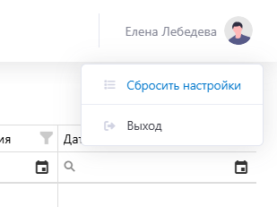

# Начало работы

## Шаг 1. Вход в систему
Чтобы войти в систему перейдите по адресу <https://rd.de-di.ru/> и введите логин и пароль, который вам выдал администратор.

{.center width=1200}

## Шаг 2. Знакомство со структурой
После входа в личный кабинет откроется страница, которую логически можно поделить на 3 части:

{.center width=1200}

1. Левый блок — это меню.
   Меню содержит отчеты, справочники, задачи на предоставление доступа, заявки дистрибьюторов и регионального склада, а также отгрузку на региональный склад и ПВЗ.
   Можно переключаться между вкладками, а также свернуть «<» и развернуть «>» меню.   
2. Верхний блок или хедер включает название открытого подраздела, команду для создания нового элемента в системе (в разных подразделах создаются разные: например, для подсистемы «Заявки дистрибьюторов» создается новая заявка, а для «Задачи на предосталвение доступа» — новая задача), а также профиль пользователя, под которым вы зашли. 
   При клике на имя пользователя или аватар появляется выпадающее меню, откуда можно сбросить настройки и выйти из профиля. 

{.center width=200}

   По команде «Сбросить настройки» настроенные вручную параметры по всем подразделам сбрасываются и выставляются автоматически.

3. Центральный блок — рабочая область.
Здесь происходит вся работа, меняется в зависимости от выбранного раздела слева.

## Шаг 3. Первые шаги
Познакомьтесь с наполнением [справочников](./directories.md) и попробуйте добавить новые элементы, настройте отображение [отчетов](./reports.md) и попробуйте сформировать за разные периоды.  

Также если требуется сделать что-то конкретное, обратитесь к соответствующему разделу в практическом руководстве.