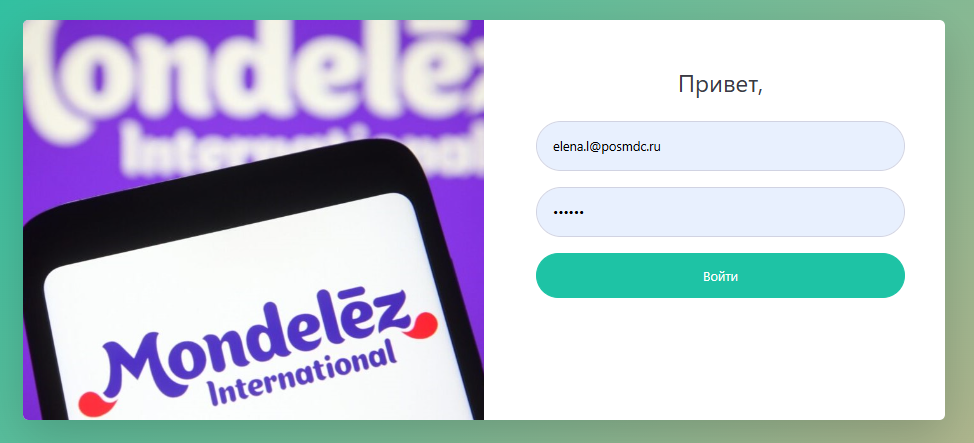
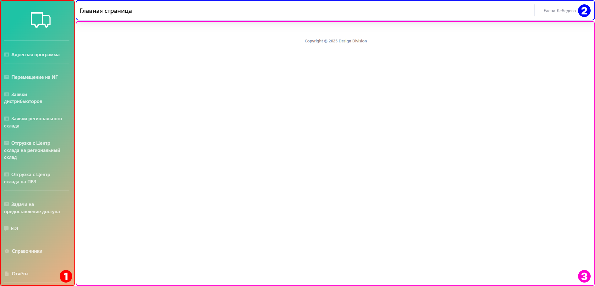

# Начало работы

## Шаг 1. Вход в систему
Чтобы войти в систему перейдите по адресу <https://rd.de-di.ru/> и введите логин и пароль, который вам выдал администратор.

{.center width=1200}

## Шаг 2. Знакомство со структурой
Страницу можно логически поделить на 3 части:

{.center width=1200}

1. Левый блок — это меню.
   Меню содержит отчеты, справочники, задачи на предоставление доступа, заявки дистрибьюторов и регионального склада, а также отгрузку на региональный склад и ПВЗ.
   
    

    По запросу от клиента в меню могут быть выведены любые необходимые подсистемы: отчеты, справочники и заявки. 

    

2. Верхний блок или хедер включает название открытого подраздела, команду для создания нового элемента, а также профиль пользователя, под которым вы зашли. 
3. Центральный блок — рабочая область.
   Здесь происходит вся работа, меняется в зависимости от выбранного раздела слева.

## Шаг 3. Первые шаги
Познакомьтесь с наполнением справочников и попробуйте добавить новые элементы, настройте отображение отчетов и сформируйте разные отчёты за разные периоды.  

Если требуется сделать что-то конкретное, обратитесь к соответствующему разделу в практическом руководстве.