# Функциональные возможности

Личный кабинет Mondelez — это централизованный инструмент для управления этапами движения товара: от планирования доставки до финальной установки и аналитики. 

Работа построена на основе взаимодействия с ключевым элементом системы — адресной программой. 

## Адресная программа (АП)

**Адресная программа** — заказ, превращённый в детальный маршрутный лист. Здесь указаны данные о том что, куда, зачем, в каком объёме необходимо привезти и что со всем этим делать.     

### Начало работы
1. Клиент получает excel-шаблон и заполняет его в соответствии с задачами.
2. В подсистеме «Адресная программа» по команде «Новая АП» клиент заполняет поля с описанием адресной программы: месяц инициативы, тип заявки движения (доставка/возврат/приход/утилизация/установка/перемещение/etc.), канал (NKA/LKA) и наименование проекта. 
Информация о дате создания, авторе, номере адресной программы и статусе проставляется автоматически.
Далее в системе появляется поле, куда загружается заполненный excel-шаблон. 

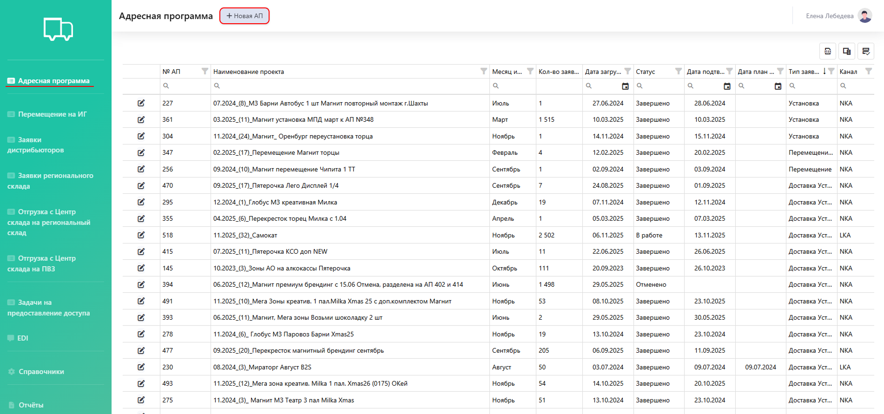{.center width=1200}



После загрузки адресной программы для редактирования доступны только тип заявки движения, канал и наименование проекта, все остальные изменения возможны путём обращения по электронной почте.



Все ранее загруженные адресные программы отображаются в таблице, которую можно скачать в формате excel (1). 
Можно внести изменения: добавить или скрыть столбцы (2), а также закрепить столбцы в определенном порядке (3).
Кроме того, по столбцам доступны: отбор по конкретному значению (4), поиск соответствий в каком-то диапазоне (5) и отбор по дате (6).   

Каждую адресную программу можно просмотреть и внести дополнительную информацию (7).

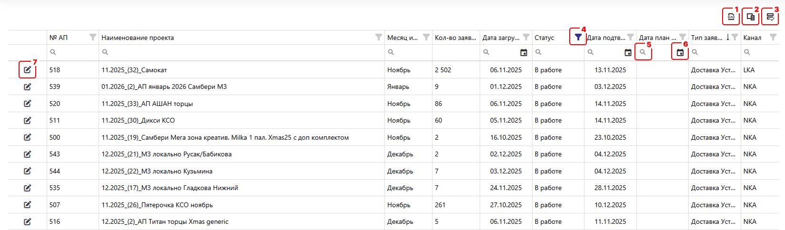{.center width=1200}

### Расчет тарифа, корректировка и смета

**Расчет тарифа** происходит на нашей стороне: менеджер рассчитывает стоимость услуг относительно утвержденных тарифов и вносит в систему. 
Чтобы увидеть расчет необходимо открыть конкретную АП и пролистать до табличной части.            

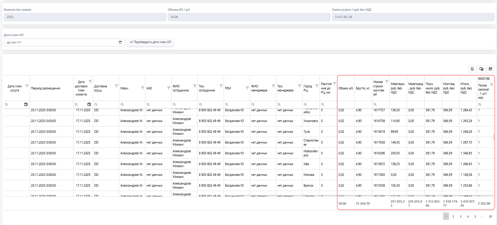{.center width=1200}

Если расчет устраивает, то по команде «Подтвердить дата план АП» клиент соглашается с полученной стоимостью и одновременно с этим указывает плановую дату по адресной программе. После этого запускается процесс исполнения.

В случае, когда требуется **корректировка АП или загрузка сметы**, клиент загружает файл в систему по команде «Загрузка сметы и корректировки» или отправляет email.  

**Корректировки вносятся нами исключительно на основании присылаемого файла.** Сам клиент поменять ничего не может. Каждый отправленный файл сохраняется и прикрепляется по конкретной АП.

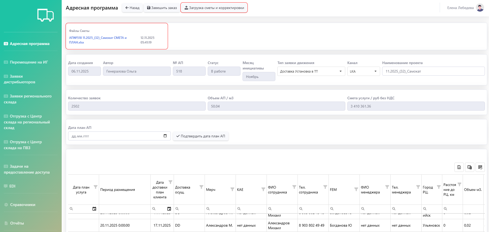{.center width=1200}

### Фотоотчёт
Если заявка выполнена, в той же табличной части адресной программы обновляются статус, фактические даты исполнения и фотоотчёт. 
Для просмотра фото в таблице необходимо кликнуть по столбцу «Фотоотчёт» в строке нужной заявки. На фотографиях указываются дата и место для удобства отслеживания.

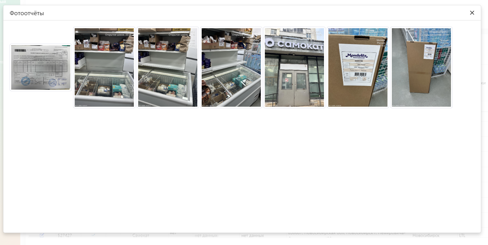{.center width=500}

## Перемещение на ИГ
В данной подсистеме вынесены адресные программы, по которым монтаж осуществляют сторонние бригады (в частности Install Group или ИГ), а наша компания организует доставку оборудования напрямую монтажным группам в нужные локации. 

Логика взаимодействия такая же, как и в подсистеме «Адресная программа».

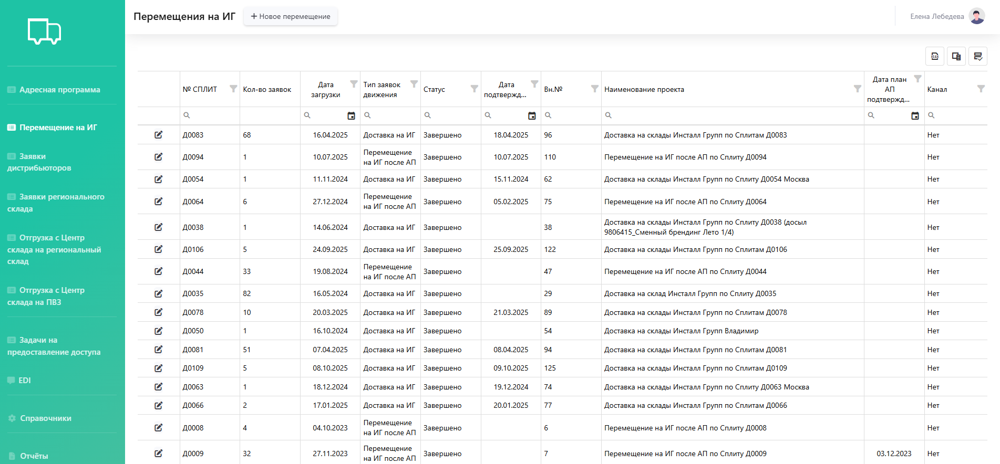{.center width=1200}

## Управление складской дистрибуцией
Для отслеживания перемещений и контроля остатков на складах **существует 5 подсистем**.   

### 1. Заявки дистрибьюторов
Дистрибьюторы — юридические лица, которым доставляется товар на их склады. Они формируют заявки и передают клиенту, который составляет по ним адресную программу.

Дальнейшая логика взаимодействия такая же, как и в подсистеме «Адресная программа».

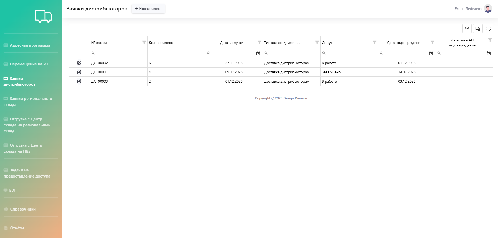{.center width=1200}

### 2. Заявки регионального склада
Отгрузка товаров на региональные склады происходит через адресную программу. Далее составляются заявки по мере необходимости товара или оборудования. 

Заявка создается из подсистемы «Заявки регионального склада» → «Новая заявка» — таким образом открывается редактор заявки регионального склада.

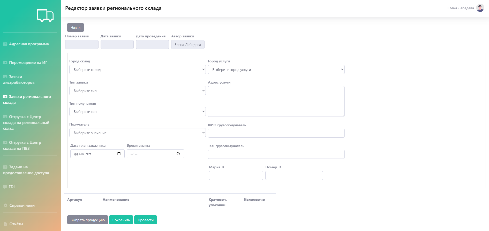{.center width=1200}

* Поля «Город склад» и «Город услуги» связаны: выбор города, в котором находится склад, определяет список городов для доставки.   

* Услуга выбирается в поле «тип заявки»: можно забрать товар самовывозом, можно оставить заявку на доставку, на доставку и монтаж, на демонтаж и возврат. 

* Поле «тип получателя» может быть: дистрибьютор, агентство, Монделиз офис, торговая точка (ТТ). Выбранный тип ограничивает список значений для поля «получатель». Например, для типа «дистрибьютор» сейчас доступно 13 получателей, а для типа «агентство» — 3. 

* Адрес получателя указывается вручную в поле «Адрес услуги» в произвольной форме. После проведения заявки адрес услуги переносится в СУУ, где операторы вручную проверяют указанный адрес для последующего корректного расчёта стоимости доставки. **Для самовывоза адрес услуги не проверяется.** 

* Планируемая дата и время визита необходимы только для самовывоза — это позволяет сотрудникам склада подготовить товар вовремя. **Для остальных типов заявки указанная дата и время визита не учитываются.**  

Кроме того, **только для самовывоза** есть возможность отметить срочность заявки. Ориентировочное время доставки 1-2 рабочих дня от даты заявки, при проставленном флажке «срочная заявка» ориентировочное время — 3 часа.    

Дополнительно можно указать данные о грузополучателе: ФИО, телефон, марка и номер транспортного средства (ТС). 

Выбор продукции осуществляется на основании актуальных складских остатков. Система позволяет выбрать только ту номенклатуру, которая есть на складе в нужном количестве, исключая возможность заказа отсутствующих или недостающих товаров.

После внесения всех данных заявку можно сохранить и провести: 
- при сохранении — информация по заявке вносится в систему, а саму заявку можно просматривать и редактировать, однако работы по заявке начнутся только после ее проведения;
- после проведения — заявка берётся в работу и её нельзя изменить, но можно добавить информацию о ФИО и телефоне грузополучателя, а также номере и марке транспортного средства. 

**Отменить или удалить заявку можно только, отправив письмо на почту.** 

### 3. Отгрузка с центрального склада на региональный склад
В данной подсистеме можно оставить заявку для пополнения запасов в регионах.
Создать заявку можно по команде «Новая заявка». 

{.center width=1200}

При создании заявки необходимо указать номер заказа, в рамках которого будет осуществляться отгрузка. Дата создания, автор и статус заявки проставляются автоматически. 

После внесения номера заказа необходимо нажать команду «Сохранить» и повторно открыть только что сохраненную заявку. Появится команда «Загрузить», с помощью которой загружается Excel-файл с информацией по отгрузкам с центрального склада. 

На основании информации из файла происходит расчет стоимости доставки с учетом габаритов и тарифов. Также можно прикрепить корректировку к уже рассчитанной заявке по команде «Загрузить смету и корректировку». 

Когда расчет завершен, менеджер, ответственный за поручение, получает сообщение на почту. По команде «подтвердить калькуляцию» расчет согласовывается, а заявка принимается в работу складом.

Отменить или удалить заявку можно только, отправив письмо на почту.  

### 4. Отгрузка с центрального склада на ПВЗ
ПВЗ — это «мини-версия» склада. По функциям и взаимодействию аналогичен складу, однако, есть 2 ключевых отличия:
- можно заказывать оборудование небольшого объема (объем одного заказа вне зависимости от количества оборудования не должен превышать 0,8 м³);
- заказчик оборудования должен забрать его в течение 7 календарных дней с момента поступления на ПВЗ. 

Добавление заявки происходит по команде «Новая заявка»:
- город выбирается только из тех, где есть ПВЗ, адрес ПВЗ проставляется автоматически в соответствии с выбранным городом;
- плановая дата, к которой необходимо доставить оборудование, а также ФИО и телефон грузополучателя можно добавить позже, если на момент создания заявки информации еще нет;
- товар добавляется в соответствии со складскими остатками через команды «Выбрать товар» или «Выбрать продукцию» (разницы между командами нет). Кроме того, для каждой номенклатуры доступен просмотр товаров в 3D.  

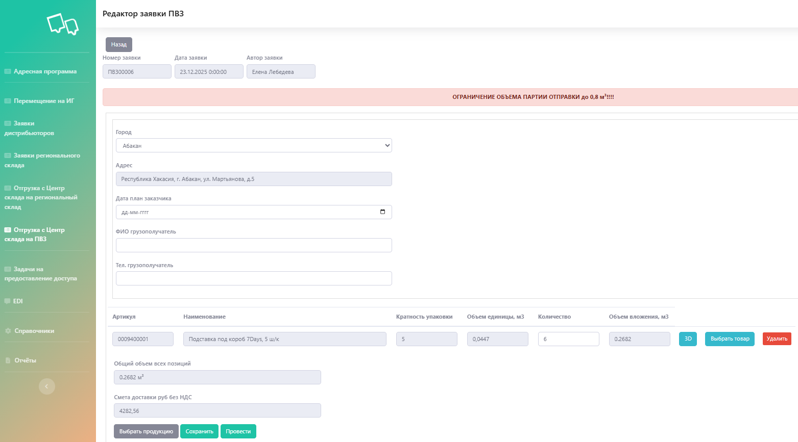{.center width=1200}

После внесения всех данных заявку можно сохранить и провести: 
- при сохранении — информация по заявке вносится в систему, а саму заявку можно просматривать и редактировать, однако работы по заявке начнутся только после ее проведения;
- при проведении — заявка берется в работу и ее нельзя изменить, но можно добавить информацию о ФИО и телефоне грузополучателя.  

Отменить или удалить заявку можно только, отправив письмо на почту. 

## 5. EDI
**EDI** — система электронного документооборота, которая является каналом синхронизации систем SAP Mondelez и СУУ. При проведении того или иного складского документа в EDI фиксируется соответствующее сообщение о движении: каждое действие с товаром (поступление, отгрузка в транзит, прибытие, установка etc.) фиксируется под уникальными номерами движений (101, 301, 305, 84, 85 и др.), что делает точнее электронный документооборот: видна вся цепочка по номеру заказа.  

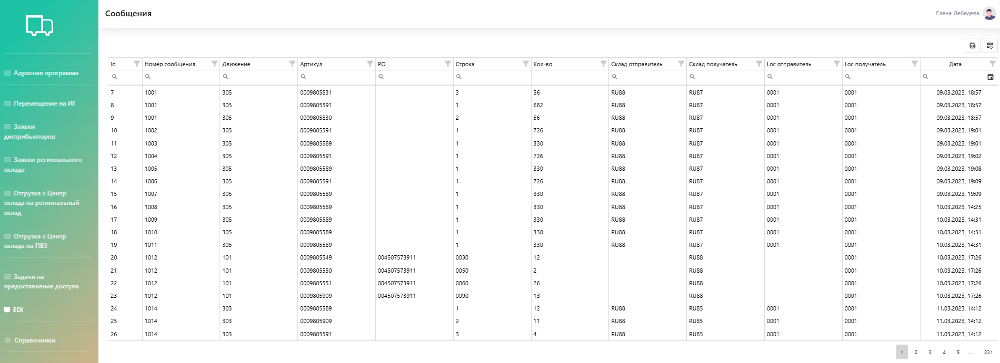{.center width=1200}

Кроме того, настроен автоматический обмен: каждый вечер система отправляет актуальные остатки по складам, таким образом оператор работает с синхронизированными остатками SAP Mondelez. 

Синхронизация с SAP Mondelez происходит только по общему остатку региональных складов, а в личном кабинете этот остаток детализируется по складам. Именно из этого детализированного распределения операторы выбирают номенклатуру для заявок. 

## Отчёты

В системе можно сформировать разные отчёты за определенный период.



- Движение

  **Отчёт «Движение»** предоставляет полную детализированную историю всех операций с товаром.

  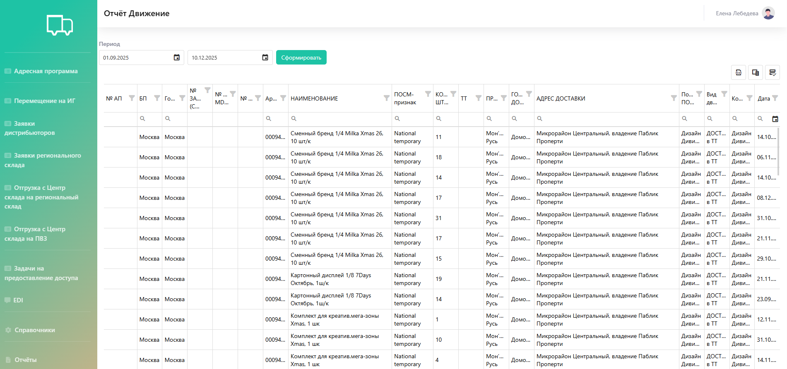{.center width=1200}

- Сеть и инициатива

  **Отчёт «Сеть и инициатива»** показывает, сколько единиц оборудования было запланировано, фактически доставлено и установлено в отчётном периоде.

  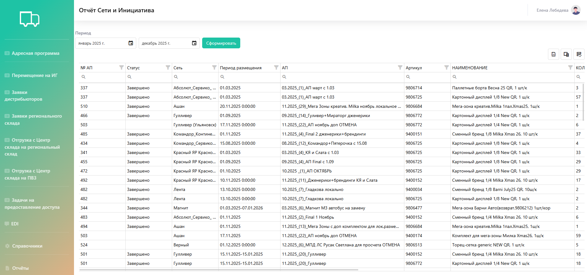{.center width=1200}

- Загрузка склада и Остатки

  **Отчёты «Загрузка склада» и «Остатки»** позволяют анализировать эффективность использования складских мощностей и управлять затратами. В отчётах фиксируются ежедневные входящие и исходящие остатки. Эти данные служат основой для точного расчёта стоимости хранения и дополнительных услуг.

  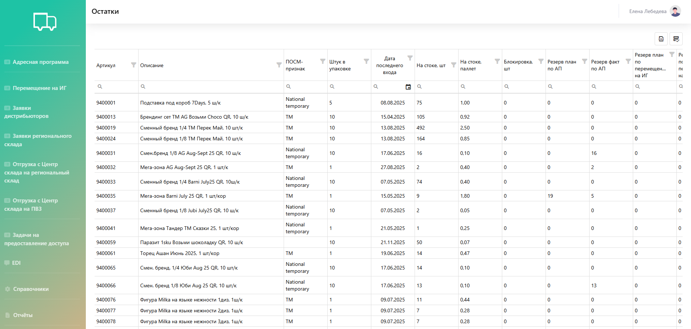{.center width=1200}

- Задачи

  **Отчёт «Задачи»** помогает видеть в реальном времени статус и детали по каждой конкретной точке назначения, отслеживать выполнение задач через фотоотчёты и выявлять проблемы.

  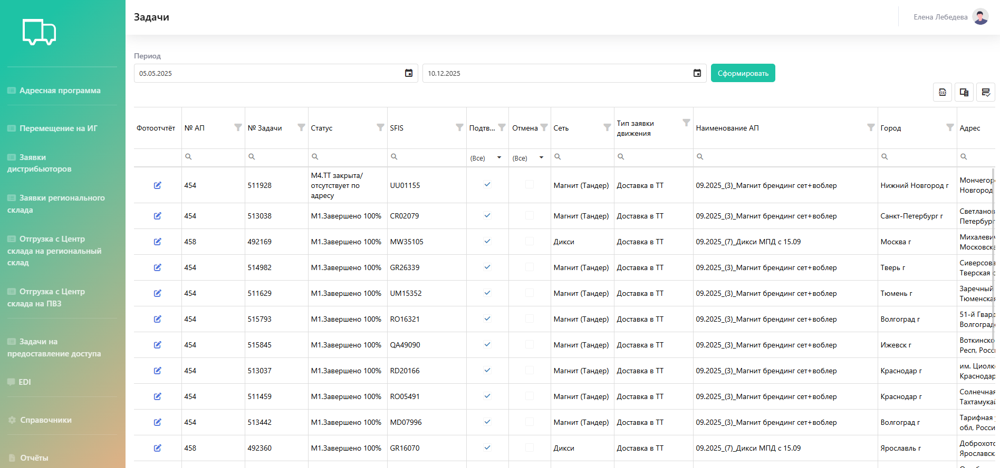{.center width=1200}

- Акты дистрибьютора

  **Отчёт «Акты дистрибьютора»** автоматически формирует акт о расходе рекламных материалов для выбранного контрагента за указанный период и выгружает его в формате Excel.  
  
  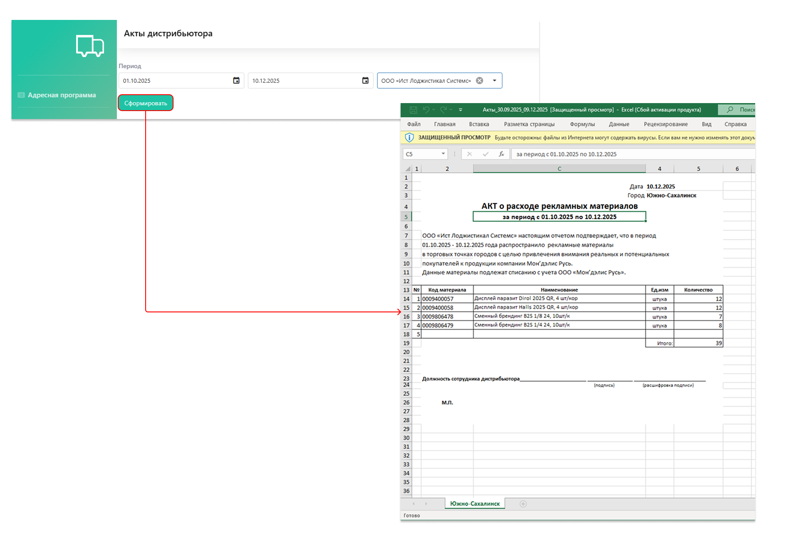{.center width=1200}

- Движения дистрибьютора

  **Отчёт «Движения дистрибьютора»** помогает контролировать товарные остатки и операции дистрибьютора.
  
  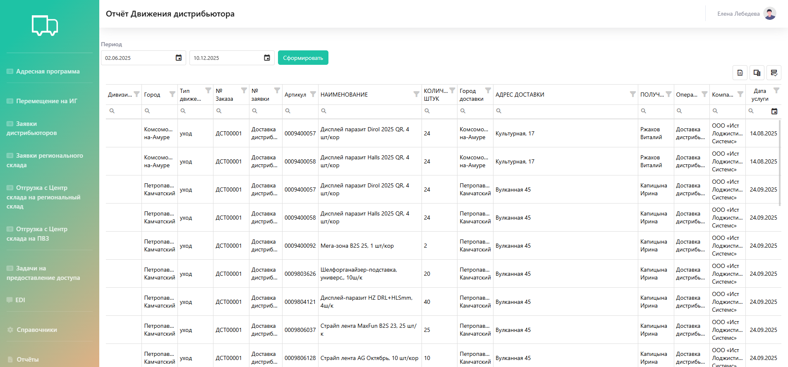{.center width=1200}



## Справочники
Для обеспечения работы в системе ведётся единая база: 
- бренды: добавляются клиентом вручную;
- компании: добавляются клиентом вручную
- лимит сметы: настраивается с нашей стороны по запросу клиента для контроля полномочий по утверждению АП (ниже лимита — подтверждают менеджеры, выше — руководители); 
- пользователи и дистрибьюторы: добавляются с нашей стороны администратором системы; 
- товары: по файлу, полученному от клиента подгружается менеджером с нашей стороны в систему.  

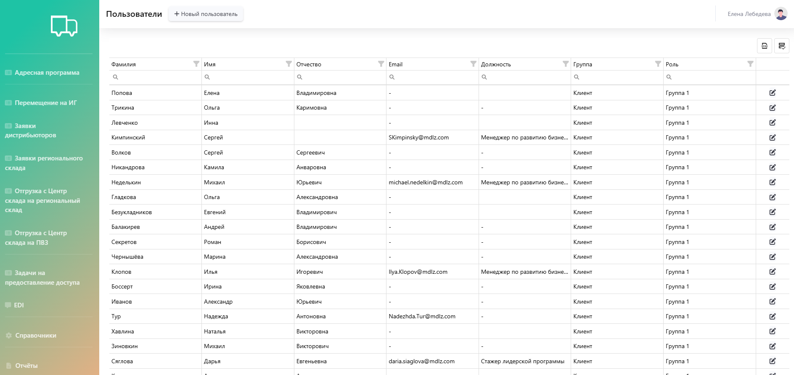{.center width=1200}