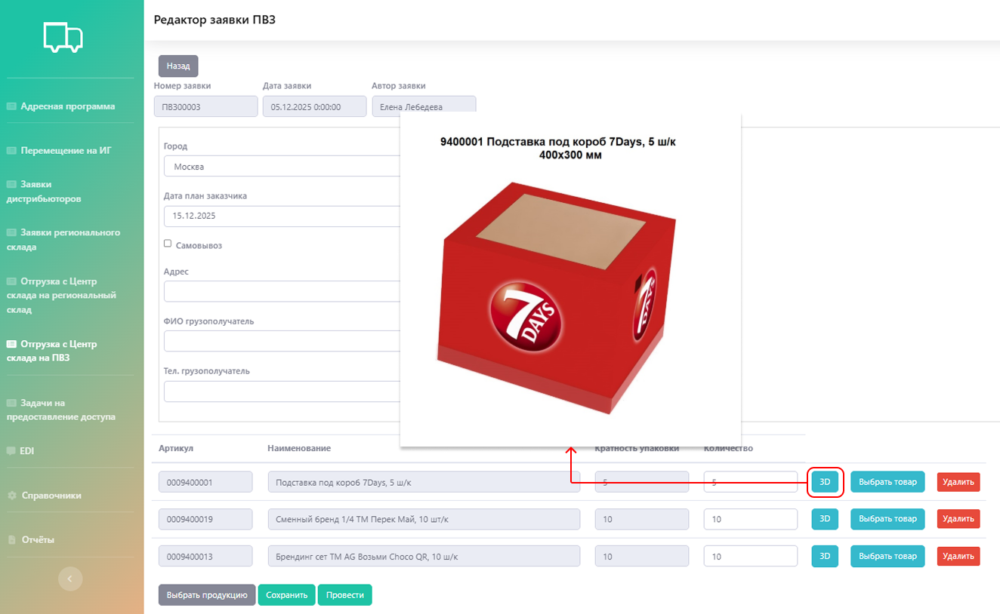

# Функциональные возможности

Личный кабинет Mondelez — это централизованный инструмент для управления этапами движения товара: от планирования доставки до финальной установки и аналитики. 

Работа построена на основе взаимодействия с ключевым элементом системы — адресной программой. 

## Адресная программа (АП)

**Адресная программа** — заказ, превращённый в детальный маршрутный лист. Здесь указаны данные о том что, куда, зачем, в каком объеме необходимо привезти и что со всем этим делать.     

### Как начать:
1. Клиент получает excel-шаблон и заполняет его в соответствии с задачами.
2. В подсистеме «Адресная программа» по команде «Новая АП» клиент заполняет поля с описанием адресной программы: месяц инициативы, тип заявки движения (доставка/возврат/приход/утилизация/установка/перемещение/etc.), канал (NKA/LKA) и наименование проекта. 
Информация о дате создания, авторе, номере адресной программы и статусе проставляется автоматически.
Далее в системе появляется поле, куда загружается заполненный excel-шаблон. 

{.center width=1200}

    

    После загрузки адресной программы в систему клиент может только изменить тип заявки движения, канал и наименование проекта, все остальные изменения возможны только по запросу через нас.

    

Все ранее загруженные адресные программы отображаются в таблице, которую можно скачать в формате excel (1). 
Можно внести изменения: добавить или скрыть столбцы (2), а также закрепить столбцы в определенном порядке (3).
Кроме того, по столбцам доступны: отбор по конкретному значению (4), поиск соответствий в каком-то диапазоне (5) и отбор по дате (6).   

Каждую адресную программу можно просмотреть и внести дополнительную информацию (7).

{.center width=1200}

### Расчет тарифа, корректировка и смета

**Расчет тарифа** происходит на нашей стороне: менеджер просчитывает стоимость услуг относительно утвержденных тарифов и вносит их в систему. 
Чтобы увидеть расчет необходимо открыть конкретную АП и пролистать до табличной части.            

{.center width=1200}

Если расчет устраивает, то по команде «Подтвердить дата план АП» клиент подтверждает согласие со стоимостью по адресной программе и одновременно с этим указывает плановую дату по адресной программе. После этого запускается процесс исполнения.

В случае, когда требуется **корректировка АП или загрузка сметы**, клиент загружает файл в систему по команде «Загрузка сметы и корректировки» или отправляет email.  

**Корректировки вносятся нами исключительно на основании присылаемого файла.** Сам клиент поменять ничего не может. Каждый отправленный файл сохраняется и прикрепляется по конкретной АП.

{.center width=1200}

### Фотоотчёт
Если заявка выполнена, все в той же табличной части адресной программы обновляется статус, фактические даты исполнения и фотоотчёт. 
Для просмотра фото в таблице необходимо кликнуть по столбцу «Фотоотчёт» в строке нужной заявки. На фотографиях указываются дата и место для удобства отслеживания.

{.center width=500}

## Перемещение на ИГ
В данной подсистеме вынесены адресные программы, по которым монтаж осуществляют сторонние бригады (в частности Install Group или ИГ), а наша компания организует доставку оборудования напрямую монтажным группам в нужные локации. 

Логика взаимодействия такая же, как и в подсистеме «Адресная программа».

{.center width=1200}

## Управление складской дистрибуцией
Для отслеживания перемещений и контроля остатков на складах **есть 5 подсистем**.   

### 1. Заявки дистрибьюторов
Дистрибьюторы — юридические лица, которым доставляется товар на их склады. Они формируют заявки и передают клиенту, который составляет по ним адресную программу.

Дальнейшая логика взаимодействия такая же, как и в подсистеме «Адресная программа».

{.center width=1200}

### 2. Заявки регионального склада
Клиент может отгрузить товары на региональные склады (через адресную программу) и далее оставлять заявки по мере необходимости того или иного оборудования или товара. 

Заявка создается из подсистемы «Заявки регионального склада» → «Новая заявка» — таким образом будет открыт редактор заявки регионального склада.

{.center width=1200}

Можно забрать товар самовывозом, можно оставить заявку на доставку, на доставку и монтаж, на демонтаж и возврат. 

Тип получателя также может быть различным: дистрибьютор, агентство, Монделиз офис, торговая точка (ТТ).    

Выбор продукции осуществляется на основании актуальных складских остатков. Система позволяет выбрать только номенклатуру, присутствующую на складе в необходимом количестве, исключая возможность заказа отсутствующих или недостающих товаров.

### 3. Отгрузка с центрального склада на региональный склад
В данной подсистеме можно оставить заявку для пополнения запасов в регионах.
Создать заявку можно по команде «Новая заявка». 

{.center width=1200}

При создании заявки необходимо указать номер заказа, в рамках которого будет осуществляться отгрузка с центрального склада, дата создания, автор и статус заявки проставляются автоматически.  

### 4. Отгрузка с центрального склада на ПВЗ
ПВЗ — это «мини-версия» склада. По функциям и взаимодействию аналогичен складу однако, есть 2 ключевых отличия:
- можно заказывать оборудование небольшого объема (до 0,8 м³);
- заказчик этого оборудования должен забрать его в течение недели. 

Заявка оставляется по команде «Новая заявка» и добавление продукции происходит в соответствии со складскими остатками. Кроме того, для товаров доступен просмотр товаров в 3D:  

{.center width=1200}

## 5. EDI
**EDI** — система электронного документооборота. 
Данная подсистема интегрирована с виртуальными складами для обмена информацией с системой клиента (SAP Mondelēz).   

Каждое действие с товаром (поступление, отгрузка в транзит, прибытие, установка и etc.) фиксируется под уникальными номерами движений (101, 301, 305, 84, 85 и др.), что делает точнее электронный документооборот: видна вся цепочка по номеру заказа.  

{.center width=1200}

Кроме того, настроен автоматический обмен: каждый вечер система отправляет актуальные остатки по складам.

## Отчёты

В системе можно сформировать разные отчёты за определенный период.

1. **Отчёт «Движение»**: полная детализированная история всех операций с товаром.

{.center width=1200}

2. **Отчёт «Сеть и инициатива»**: показывает, сколько единиц оборудования было запланировано, фактически доставлено и установлено в отчётном периоде.

{.center width=1200}

3. **Отчёты «Загрузка склада» и «Остатки»**: позволяет анализировать эффективность использования складских мощностей и управлять затратами. Фиксируются ежедневные входящие/исходящие остатки, что является основой для точного расчёта стоимости хранения и дополнительных услуг.

{.center width=1200}

4. **Отчёт «Задачи»:** помогает в реальном времени видеть статус и детали по каждой конкретной точке назначения, отслеживать выполнение задач через фотоотчёты и выявлять проблемы. 

{.center width=1200}

5. **Отчёт «Акты дистрибьютора»**: автоматически формируется акт о расходе рекламных материалов для выбранного контрагента за указанный период в формате excel-файла  

{.center width=1200}

6. **Отчёт «Движения дистрибьютора»:** помогает контролировать товарные остатки и операции дистрибьютора. 

{.center width=1200}

## Справочники
Для обеспечения работы в системе ведется единая база: 
- бренды: добавляются клиентом вручную;
- компании: добавляются клиентом вручную
- лимит сметы: настраивается с нашей стороны по запросу клиента для контроля полномочий по утверждению АП (ниже лимита — подтверждают менеджеры, выше — руководители); 
- пользователи и дистрибьюторы: добавляются с нашей стороны администратором системы; 
- товары: по файлу, полученному от клиента подгружается менеджером с нашей стороны в систему.  

{.center width=1200}